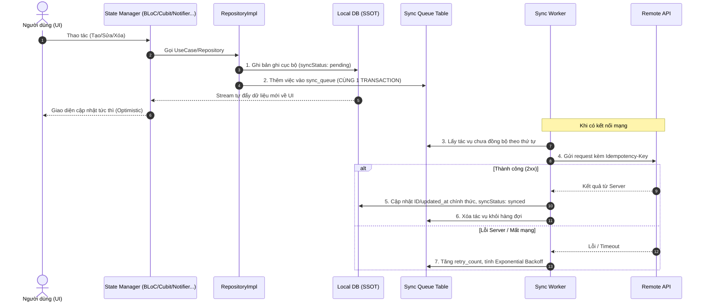

# PATTERN: OFFLINE-FIRST + OUTBOX SYNC

> ⚠️ **CHỈ ÁP DỤNG KHI** `PROJECT_STACK.md` bật mục *Offline-First + Outbox Sync = có*.
> Nếu dự án không cần hoạt động ngoại tuyến/đồng bộ hai chiều, **BỎ QUA** toàn bộ tài liệu này để tránh phức tạp hóa không cần thiết.

> **PHẠM VI**: Pattern này tự chứa (self-contained). Các ví dụ code giả định dự án dùng một **Local DB có transaction & reactive stream** (ví dụ: Drift, Isar, ObjectBox...). Cú pháp minh họa theo phong cách Drift; hãy chuyển đổi tương ứng theo DB dự án đã khai báo trong `PROJECT_STACK.md`.

---

## 1. NGUYÊN LÝ VÀNG: LOCAL DB LÀ SINGLE SOURCE OF TRUTH (SSOT)

1. **UI luôn đọc dữ liệu từ Local DB** thông qua luồng `Stream` reactive (ví dụ `watch()`), **không bao giờ chờ Server** để hiển thị nội dung có thể lưu cục bộ.
2. **Optimistic UI**: Khi người dùng Thêm/Sửa/Xóa, dữ liệu ghi ngay vào Local DB → Stream đẩy về UI tức thì (zero latency), không đợi phản hồi mạng.
3. **Ranh giới**: Không đọc song song cả remote và local gây xung đột trạng thái hiển thị. Remote chỉ cập nhật gián tiếp thông qua việc ghi vào Local DB.

---

## 2. KIẾN TRÚC ĐỒNG BỘ (OUTBOX SYNC PATTERN)



---

## 3. QUY TẮC BẮT BUỘC KHI BẬT PATTERN

### 3.1. Tính toàn vẹn Transaction
- Ghi bảng nghiệp vụ **và** ghi hàng đợi `sync_queue` **BẮT BUỘC** nằm trong **cùng 1 transaction** để tránh dữ liệu đã ghi nhưng không được đưa vào hàng đợi.

```dart
// Giả định dùng local DB (ví dụ Drift)
Future<void> saveWithSyncQueue(EntityCompanion entity, SyncQueueCompanion queueEntry) {
  return transaction(() async {
    await into(entities).insertOnConflictUpdate(entity);
    await into(syncQueueEntries).insert(queueEntry);
  });
}
```

### 3.2. Chiến lược ID — Khuyến nghị UUID v7
- Entity tạo ở Client dùng **UUID làm khóa chính dạng String** (không auto-increment integer) để tránh xung đột ID khi đồng bộ đa thiết bị.
- **Khuyến nghị UUID v7 (time-ordered)** thay vì v4: v7 nhúng timestamp ở phần đầu → khóa chính tăng dần theo thời gian, tối ưu **index locality** của B-tree (SQLite), giảm page-split/phân mảnh khi insert nhiều, đồng thời vẫn duy nhất chống xung đột đa thiết bị.

```dart
import 'package:uuid/uuid.dart';
const _uuid = Uuid();
final String id = _uuid.v7(); // ✅ time-ordered; tránh _uuid.v4() cho khóa chính
```

### 3.3. Soft-delete (Xóa mềm)
- **Không `DELETE` vật lý** khi offline (mất dấu vết cần gửi lệnh DELETE lên Server).
- Khi xóa: gán `isDeleted = true`, `syncStatus = 'pending'`, và thêm tác vụ `DELETE` vào `sync_queue`.

### 3.4. Các cột bắt buộc cho bảng syncable
| Cột | Ghi chú |
|---|---|
| `id` | UUID v7 (String), primary key |
| `createdAt` | Lưu **UTC** (xem `rules/19`) |
| `updatedAt` | Lưu **UTC**, dùng cho LWW |
| `syncStatus` | `'synced' | 'pending' | 'error'` |
| `isDeleted` | soft-delete flag |

### 3.5. Giải quyết xung đột (Conflict Resolution)
- Mặc định **Last-Write-Wins (LWW)** dựa trên `updatedAt` **so sánh ở UTC** (xem `rules/19`).
- Ưu tiên **Server-authoritative**: bản ghi đã `synced` dùng `updatedAt` do Server gán; chỉ bản ghi `pending` dùng timestamp client. Chống clock skew phá vỡ LWW.

### 3.6. Lắng nghe kết nối mạng
- Dùng package connectivity chuẩn (khai báo trong `PROJECT_STACK.md`) phát hiện Offline → Online, tự kích hoạt `SyncWorker.processPendingQueue()`.
- Bổ sung đồng bộ định kỳ (15–30 phút) khi app hoạt động để kéo dữ liệu mới về.

### 3.7. Phân trang cục bộ chống OOM
- **CẤM** nạp toàn bộ bảng lớn (>100 bản ghi) vào RAM bằng `watchAll()`.
- Bắt buộc truy vấn `limit`/`offset` hoặc keyset pagination; State Manager quản lý infinite scroll.

```dart
Stream<List<EntityData>> watchPaged({required int limit, required int offset}) {
  return (select(entities)
        ..where((t) => t.isDeleted.equals(false))
        ..orderBy([(t) => OrderingTerm(expression: t.updatedAt, mode: OrderingMode.desc)])
        ..limit(limit, offset: offset))
      .watch();
}
```

---

## 4. BẢNG HÀNG ĐỢI (SYNC QUEUE TABLE)

```dart
// Giả định dùng local DB (ví dụ Drift)
class SyncQueueEntries extends Table {
  IntColumn get queueId => integer().autoIncrement()();
  TextColumn get entityType => text()();   // 'order', 'user', ...
  TextColumn get entityId => text()();     // UUID v7 của bản ghi
  TextColumn get action => text()();       // 'CREATE' | 'UPDATE' | 'DELETE'
  TextColumn get payloadJson => text()();  // dữ liệu JSON cần gửi
  IntColumn get retryCount => integer().withDefault(const Constant(0))();
  DateTimeColumn get createdAt => dateTime()();       // UTC
  DateTimeColumn get nextRetryAt => dateTime().nullable()();
  TextColumn get lastError => text().nullable()();
}
```

---

## 5. SYNC WORKER (RETRY / BACKOFF / IDEMPOTENCY)

```dart
Future<void> processSyncQueue() async {
  final now = DateTime.now().toUtc();
  final pending = await syncQueueDao.getProcessableEntries(now);

  for (final item in pending) {
    try {
      // BẮT BUỘC gửi Idempotency-Key = item.entityId để Server nhận biết request lặp
      await _dispatch(item);              // route theo entityType + action
      await syncQueueDao.deleteEntry(item.queueId);
    } on Object catch (e) {
      // 4xx: dữ liệu/nghiệp vụ sai -> markAsError, KHÔNG retry vô hạn
      // 5xx/mạng: tăng retryCount + Exponential Backoff
      final next = item.retryCount >= 5
          ? null
          : DateTime.now().toUtc().add(Duration(seconds: 1 << item.retryCount));
      await syncQueueDao.markRetry(item.queueId, item.retryCount + 1, next, e.toString());
    }
  }
}
```

**Idempotency**: luôn gửi `UUID` của entity làm `Idempotency-Key` trong header HTTP để Server bỏ qua request trùng do chập chờn mạng, tránh tạo bản ghi/giao dịch trùng lặp.

---

## 6. CHECKLIST KHI BẬT PATTERN NÀY

- [ ] `PROJECT_STACK.md` đã bật Offline-First và khai báo Local DB + connectivity lib.
- [ ] Bảng nghiệp vụ có đủ cột: `id`(UUID v7), `createdAt`/`updatedAt`(UTC), `syncStatus`, `isDeleted`.
- [ ] Ghi nghiệp vụ + `sync_queue` trong cùng 1 transaction.
- [ ] Soft-delete thay cho DELETE vật lý.
- [ ] Sync Worker có retry/backoff + Idempotency-Key.
- [ ] LWW so sánh `updatedAt` ở UTC, ưu tiên server-authoritative.
- [ ] Danh sách lớn dùng phân trang, không `watchAll()`.
- [ ] Đã ghi ADR quyết định bật Offline-First trong `memory/architecture-decisions.md`.
