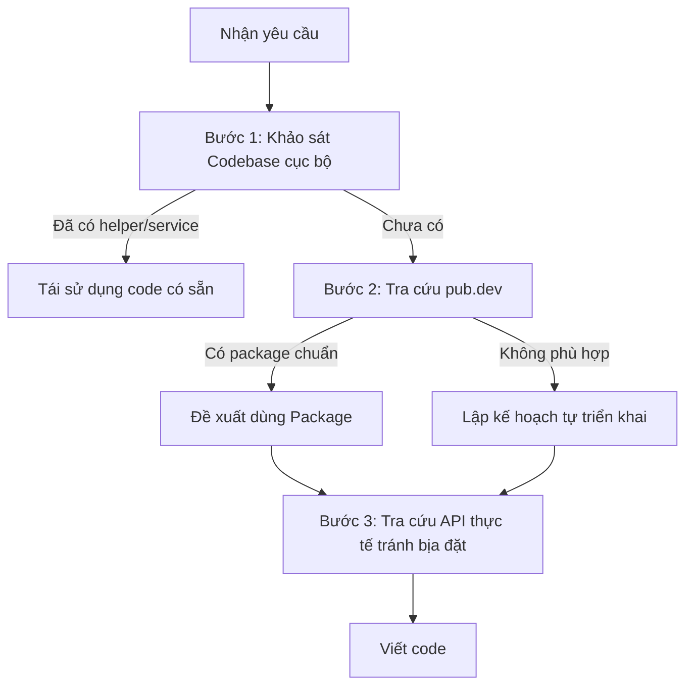

# RULE 13: NGHIÊN CỨU TRƯỚC, CHỐNG BỊA ĐẶT & TẬN DỤNG PUB.DEV

## 1. NGUYÊN TẮC VÀNG VỀ NGHIÊN CỨU (RESEARCH-FIRST PROTOCOL)
Trước khi tạo tính năng mới hoặc giải quyết một vấn đề kỹ thuật, Agent **BẮT BUỘC** theo 3 bước trước khi gõ dòng code nào:

### Bước 1 — Khảo sát Codebase cục bộ
- Kiểm tra `lib/core/` (utils, extensions, services, widgets dùng chung) và `pubspec.yaml` để tránh viết lại/cài trùng thứ đã có.

### Bước 2 — Tra cứu pub.dev
- Với bài toán phổ biến (format tiền/ngày, mask input, uuid, connectivity, shimmer, QR, crop ảnh...), **BẮT BUỘC** kiểm tra pub.dev đã có giải pháp chuẩn chưa.
- **Tiêu chí đánh giá package**:
  - Ưu tiên **Flutter Favorite** / verified publisher.
  - Pub Points cao (≥130/160), cập nhật gần đây, tương thích Dart 3 + null safety.
  - Likes/Popularity cao; không dùng package bị bỏ hoang/xung đột dependencies.

### Bước 3 — Tra cứu API thực tế (Ground-Truth Verification)
- Không đoán mò cú pháp. Đọc định nghĩa class/hàm trong package hoặc tài liệu chính thức để xác thực method signature, tham số, kiểu trả về.

---

## 🚫 2. CHỐNG BỊA ĐẶT MÃ NGUỒN (ANTI-HALLUCINATION)
1. ❌ **CẤM bịa tên hàm/thuộc tính/getter không tồn tại** (ví dụ gọi `state.itemsList` khi state chỉ có `items`; bịa `gap:` trong `Row` chuẩn).
2. ❌ **CẤM bịa named parameters**: đối chiếu đúng định nghĩa Widget/Function trong SDK trước khi truyền.
3. ❌ **CẤM bịa package ma (Phantom Packages)** không có thật/đã gỡ khỏi pub.dev.
4. ✅ **Khi không chắc**: đọc file thư viện hoặc chạy `flutter analyze` ngay sau khi viết để kiểm chứng.

---

## 🛑 3. KHÔNG TỰ CHẾ LẠI BÁNH XE (DON'T REINVENT THE WHEEL)

Ưu tiên package chuẩn cho các bài toán tiện ích phổ quát:

| Bài toán | Package tiêu chuẩn (ví dụ) | Lý do không tự code |
|---|---|---|
| Định dạng ngày/tiền | `intl` | Regex/format tự viết dễ sai locale/timezone |
| Sinh ID duy nhất | `uuid` | Random string tự sinh dễ trùng khi đa thiết bị |
| Theo dõi kết nối mạng | `connectivity_plus`, `internet_connection_checker_plus` | Tự ping dễ false positive/treo UI |
| Skeleton loading | `shimmer` | Tự vẽ CustomPainter tốn công, khó tối ưu GPU |
| Vector graphics | `flutter_svg` | Flutter thuần không hỗ trợ SVG gốc |
| Mask input (phone, số...) | `mask_text_input_formatter` | `TextInputFormatter` tự viết dễ lỗi con trỏ |
| Lưu trữ an toàn | `flutter_secure_storage` | Tự mã hóa dễ lộ master key |
| Functional error (nếu dự án chọn) | `fpdart` / `dartz` | Chỉ thêm khi `PROJECT_STACK.md` chọn hướng Either — không mặc định |

### Khi nào ĐƯỢC tự viết custom code?
- Bài toán gắn nghiệp vụ đặc thù của dự án.
- Package quá cồng kềnh mà chỉ cần một helper < 15 dòng thuần.
- Đã được người dùng đồng ý sau thảo luận.

## 4. QUY TẮC BẮT BUỘC
- ✅ Research codebase + pub.dev trước; đối chiếu API thực; ưu tiên package battle-tested.
- ❌ **CẤM** code mù/bịa đặt; **CẤM** tự chế cho bài toán đã có package chuẩn (trừ ngoại lệ ở trên).
