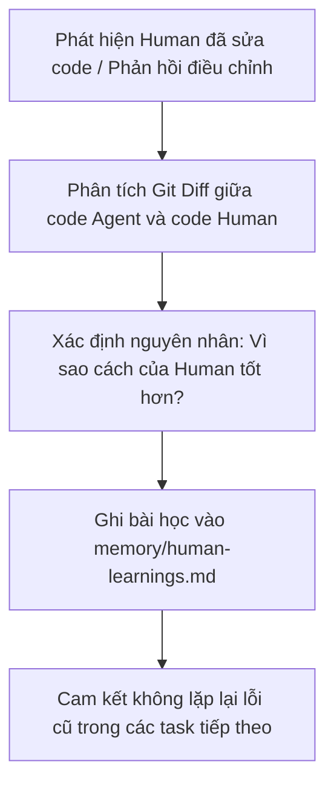

# RULE 14: VẬN HÀNH AI MEMORY & HỌC TẬP TỪ CAN THIỆP CỦA CON NGƯỜI (HUMAN-IN-THE-LOOP)

## 1. NGUYÊN TẮC TIẾT KIỆM TOKEN VỚI AI MEMORY (TOKEN SAVING PROTOCOL)

Khi dự án mở rộng, việc đọc quét hàng chục file source code mỗi phiên làm việc sẽ làm cạn kiệt context window và lãng phí token request. Agent **BẮT BUỘC** áp dụng quy chế 2 bước:

1. **Bước 1 - Đọc Memory trước khi đọc Source Code**:
   - Khi được giao nhiệm vụ liên quan đến một module đã có, Agent **ĐỌC TRƯỚC** `memory/context-cache.md` và `memory/architecture-decisions.md` (và luôn đọc `PROJECT_STACK.md` để biết công nghệ dự án chọn).
   - Chỉ đọc chi tiết các file mã nguồn cụ thể khi thực sự cần chỉnh sửa trực tiếp trên file đó.
2. **Bước 2 - Tự động ghi nhớ sau khi hoàn thành Task**:
   - Mỗi khi hoàn thành một module/tính năng có độ phức tạp từ **Trung bình đến Cao**, Agent **BẮT BUỘC** cập nhật một đoạn tóm tắt ngắn (10-15 dòng) vào `context-cache.md`.
   - Trước khi tin vào cache: đối chiếu nhanh với thực tế mã nguồn; nếu cache đã lỗi thời (stale) so với code, cập nhật lại thay vì dùng thông tin cũ.

---

## 🧑‍💻 2. QUY TRÌNH HỌC TẬP KHI CON NGƯỜI CAN THIỆP CODE (HUMAN INTERVENTION LEARNING)

Mỗi khi người dùng (Human) tự tay sửa code của Agent, đảo ngược quyết định hoặc góp ý chấn chỉnh:

### Các bước thực hiện cụ thể:
1. **Phân tích Diff**: Đọc sự khác biệt giữa phiên bản code Agent đề xuất và phiên bản Human đã điều chỉnh.
2. **Nhận diện nguyên tắc ngầm**: Human đang ưu tiên điều gì? (Tính ngắn gọn? Hiệu năng? Thói quen đặt tên? Thư viện ưa thích? Cấu trúc widget tách nhỏ? Một quy ước riêng của dự án?)
3. **Cập nhật nhật ký học tập**: Bổ sung một mục mới vào `memory/human-learnings.md`.
4. **Áp dụng vĩnh viễn**: Các task sau này phải luôn kiểm tra `human-learnings.md` để áp dụng đúng quy chuẩn Human mong muốn.
5. **Nâng cấp lên quy tắc/ADR nếu cần**: Nếu bài học có tính hệ thống, đề xuất Human ghi thành ADR hoặc bổ sung `PROJECT_STACK.md`.

---

## 🧭 3. CHẾ ĐỘ HƯỚNG DẪN TƯƠNG TÁC (GUIDE MODE)

Khi đối mặt với bài toán phức tạp hoặc ranh giới kiến trúc chưa rõ ràng:

1. **Không "làm bừa" rồi chờ Human sửa**:
   - Nếu có nhiều cách triển khai khả dĩ (ví dụ: cách chia module, cách thiết kế cấu trúc dữ liệu, cách tổ chức state), Agent **KHÔNG ĐƯỢC** tự tiện chọn một cách rồi viết hàng trăm dòng code.
2. **Kích hoạt Chế độ Guide (Xin ý kiến định hướng)**:
   - Agent dừng lại, tóm tắt bài toán thành 2-3 phương án tiếp cận rõ ràng.
   - Nêu ưu/nhược điểm ngắn gọn của từng phương án.
   - Đề xuất phương án khuyến nghị và hỏi xin chỉ dẫn từ Human trước khi bắt tay viết code.
3. **Lợi ích**: Tiết kiệm thời gian sửa code cho Human; tránh lãng phí token sinh ra code sai hướng.
