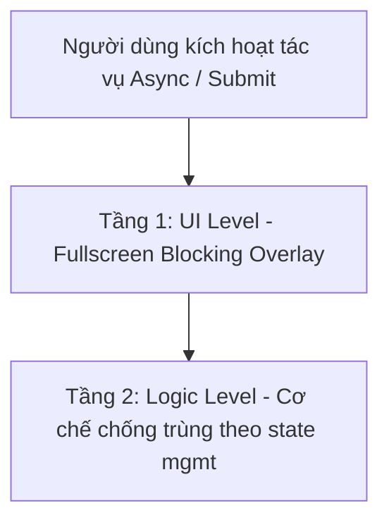

# RULE 16: RÀO CHẮN TƯƠNG TÁC BẤT ĐỒNG BỘ (ASYNC UX GUARD & ANTI-DOUBLE-CLICK)

> **MỤC ĐÍCH**: Mọi thao tác `async await` (submit form, gọi API, ghi DB, đồng bộ) phải có phản hồi khóa tương tác để triệt tiêu double-click, duplicate request và race condition — trên bất kỳ stack state-management nào.

---

## ⚠️ 1. VẤN ĐỀ CỐT LÕI

1. **Nguy cơ khi không khóa tương tác**: Người dùng bấm nút thực hiện tác vụ async (đóng tiền, tạo mới, xóa...) rồi bấm dồn dập (spam/double-tap) → gửi 2-3 request trùng, tạo bản ghi trùng, trừ tiền nhiều lần, ghi rác.
2. **Vì sao KHÔNG dùng Button-level Spinner**:
   - **Lỗi UI/UX**: Thay nhãn button bằng `CircularProgressIndicator` nhỏ gây "giật/nhảy" layout (button co giãn, text lệch, vỡ alignment form).
   - **Dư thừa**: Khi đã có overlay che toàn màn hình, mọi tương tác chạm đã bị khóa 100% → spinner trong button là thừa và gây rối mắt.

---

## 🛡️ 2. QUY TẮC 2 TẦNG BẢO VỆ (2-TIER PROTECTION)



### 🌟 Tầng 1: UI Level — Fullscreen Blocking Overlay / Dialog
- Mọi thao tác có `async await` **BẮT BUỘC** kích hoạt Fullscreen Loading Overlay/Dialog qua một util modal dùng chung của dự án (ví dụ `AppModals.showLoadingDialog(context, message: '...')`).
- **Cơ chế khóa tương tác toàn diện**:
  - `barrierDismissible: false`: chặn 100% chạm/click ra ngoài modal.
  - `PopScope(canPop: false)`: chặn cử chỉ vuốt back iOS và nút Back vật lý Android, bảo vệ tiến trình async không bị ngắt.
  - Hiển thị spinner trung tâm rõ ràng với thông điệp dễ hiểu.
- Khi tác vụ hoàn tất (thành công/thất bại), **BẮT BUỘC** đóng overlay (thường điều phối qua listener của lớp state khi state chuyển Success/Error).

```dart
// ✅ Ví dụ điều phối overlay dựa trên trạng thái submit (khái quát, không phụ thuộc lib cụ thể)
if (state.isSubmitting) {
  AppModals.showLoadingDialog(context, message: 'Đang xử lý...');
} else {
  AppModals.hideLoadingDialog(context);
}
```

### ⚙️ Tầng 2: Logic Level — Chống Double-Click / Race Condition
- Tầng phòng ngự logic **độc lập với UI**. Cơ chế cụ thể **tùy theo state management dự án đã khai báo trong `PROJECT_STACK.md`**:
  - **BLoC/Cubit**: gắn transformer `droppable()` từ `bloc_concurrency` cho mọi event mutation (Create/Update/Delete/Submit/Payment) → event đến khi event trước chưa xong sẽ bị hủy.
  - **Riverpod / Provider / Notifier**: dùng cờ `isSubmitting`/lock + kiểm tra đầu hàm để bỏ qua lời gọi trùng, hoặc `AsyncNotifier` guard.
  - **Cách tổng quát khác**: mutex/lock đơn giản, debounce/throttle cho input, hoặc vô hiệu hóa trigger ở tầng logic (không phải ở button).
- **Mục tiêu chung (bất biến)**: nếu tác vụ trước đang chạy, mọi lời gọi mutation đến sau **bị loại bỏ ngay ở tầng logic**, không xếp hàng, không gửi trùng.

---

## 📋 3. CHECKLIST TỰ KIỂM TRA

| Tiêu chí | Câu hỏi | Đạt yêu cầu |
|---|---|:---:|
| **Fullscreen Overlay** | Thao tác async có overlay che phủ 100% màn hình không? | ✅ CÓ |
| **Chặn Back & click ngoài** | Overlay có `barrierDismissible: false` và `PopScope(canPop: false)` không? | ✅ CÓ |
| **Không Button Spinner** | Có nhồi spinner vào button gây giật layout không? | ❌ KHÔNG |
| **Chống trùng tầng logic** | Mutation có cơ chế chống double-call theo stack đã chọn không? | ✅ CÓ |
