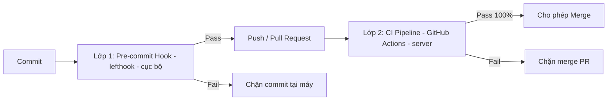

# RULE 18: CƯỠNG CHẾ CHẤT LƯỢNG TỰ ĐỘNG (CI/CD & PRE-COMMIT ENFORCEMENT)

> **MỤC ĐÍCH**: Biến các cổng chất lượng (`analyze`, `test`, code-gen) từ "kỷ luật tự giác" thành **hàng rào cưỡng chế bằng máy**, để không ai — dù agent thiếu tuân thủ hay con người vội — bỏ qua được.

---

## 1. NGUYÊN TẮC VÀNG: "SHIFT-LEFT" 2 LỚP

- **Lớp 1 – Pre-commit (`lefthook`)**: chạy nhanh tại máy, bắt lỗi rẻ tiền, phản hồi tức thì.
- **Lớp 2 – CI (`GitHub Actions`)**: chạy đầy đủ trên server, là **chân lý cuối cùng** quyết định merge. Bật **Branch Protection** yêu cầu CI pass mới cho merge vào `main`/`develop`.

> Template có sẵn: `templates/ci_workflow.yaml.tpl` và `templates/lefthook.yml.tpl`. Sao chép ra `.github/workflows/ci.yml` và `lefthook.yml` khi khởi tạo dự án, rồi `dart run lefthook install`.

---

## 2. CÁC CHỐT CHẶN CỦA CI PIPELINE

Chạy trên mỗi `push` và `pull_request`, **fail-fast**:

| STT | Bước | Lệnh | PASS khi |
|---|---|---|---|
| 1 | Cài đặt | `flutter pub get` | resolve thành công |
| 2 | Sinh mã *(nếu dự án dùng code-gen)* | `dart run build_runner build --delete-conflicting-outputs` | không lỗi |
| 3 | Format | `dart format --output=none --set-exit-if-changed .` | không file lệch format |
| 4 | Phân tích tĩnh | `flutter analyze --fatal-infos --fatal-warnings` | **0 errors/warnings/infos** |
| 5 | Test + coverage | `flutter test --coverage` | pass 100% + đạt ngưỡng coverage (theo `PROJECT_STACK.md`) |
| 6 | Chống drift generated *(nếu dùng code-gen)* | `git diff --exit-code` sau build_runner | file generated đồng bộ với source đã commit |

> Bước 6 phát hiện trường hợp sửa model nhưng quên chạy code-gen → chặn merge.

---

## 3. CÁC CHỐT CHẶN CỦA PRE-COMMIT HOOK

Chạy trên file staged (nhanh):
1. **`dart format`** các file staged.
2. **`flutter analyze`** — chặn nếu có warning/error.
3. **Chặn `print()` / `debugPrint()`** trong `lib/` (tuân thủ `rules/09`).
4. **Chặn sửa tay file generated** (tuân thủ `rules/07`, nếu dự án dùng code-gen).
5. **`commit-msg`**: kiểm tra Conventional Commits (`rules/12`).

---

## 4. QUY TẮC BẮT BUỘC

- ✅ Coi **CI là chân lý cuối cùng**: CI đỏ = task chưa hoàn thành dù máy cục bộ xanh.
- ❌ **CẤM** vô hiệu hóa hook (`--no-verify`) hoặc nới lỏng ngưỡng CI để "cho qua" khi chưa được Người dùng đồng ý.
- ❌ **CẤM** commit khi pre-commit hook báo đỏ.

---
*Liên quan: `rules/07` (code-gen), `rules/09` (logging), `rules/11` (testing), `rules/12` (git).*
