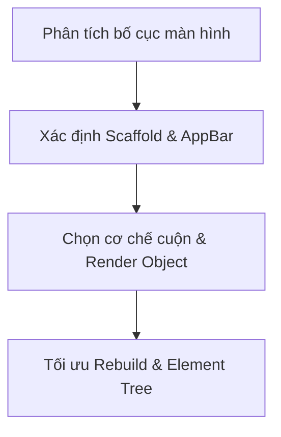

# 🎯 FLUTTER WIDGET OPTIMIZER (SENIOR FLUTTER SKILL)

Skill cung cấp quy trình & tư duy giúp Agent đóng vai **Senior Flutter Developer** khi dựng/review giao diện. Đây là kiến thức framework Flutter thuần, độc lập với state management hay backend.

## 🛠️ KHI NÀO DÙNG?
1. Chuẩn bị dựng màn hình mới hoặc cụm widget phức tạp.
2. Gặp lỗi `RenderFlex overflowed by ... pixels` hoặc `... incoming height constraints are unbounded`.
3. Danh sách cuộn giật lag, tụt FPS, ngốn RAM.
4. Màn hình có topbar tùy biến, bàn phím bật/tắt, hiệu ứng cuộn co giãn.

## 🧭 QUY TRÌNH 4 BƯỚC

### Bước 1: Scaffold, AppBar & Nói KHÔNG với SafeArea
- `Scaffold` là khung nền cấp cao nhất của màn hình. **Không bọc `SafeArea` ra ngoài `Scaffold`** (mất edge-to-edge, co rúm bottom bar).
- TopBar tùy biến: đặt trong `Scaffold.appBar: PreferredSize(...)` hoặc `SliverAppBar`. Không nhét vào `body: Column`.
- **ĐÃ DÙNG SCAFFOLD THÌ TUYỆT ĐỐI KHÔNG DÙNG SAFEAREA**: cả hai cùng tính insets top/bottom; `Scaffold` đã điều phối qua `appBar`/`bottomNavigationBar`/`resizeToAvoidBottomInset`. Dùng `SafeArea` trong `body` gây double padding & hỏng cuộn tràn viền. `SafeArea` chỉ dùng cho component/dialog/bottom sheet standalone không có `Scaffold`.

### Bước 2: Cơ chế cuộn & Virtualization
Hỏi: **"Danh sách này bao nhiêu phần tử?"**
- **≤ 10 phần tử cố định** (form, màn hình cài đặt ngắn): `SingleChildScrollView` + `Column`.
- **> 10 hoặc danh sách động từ DB/API**: **bắt buộc `ListView.builder` / `SliverList.builder`** (ảo hóa bộ nhớ). Nếu item cao cố định: thêm `itemExtent` hoặc `prototypeItem` để cuộn $O(1)$.
- **Header co giãn/sticky + list**: `CustomScrollView` + `SliverAppBar` + `SliverList`.

### Bước 3: Ràng buộc & Chống Overflow
- Trong trục cao vô hạn (`SingleChildScrollView`/`ListView`): **không dùng `Expanded`/`Spacer`** trực tiếp trong `Column` con.
- Đẩy nút xuống đáy form có cuộn: `LayoutBuilder` + `ConstrainedBox(minHeight: constraints.maxHeight)` + `IntrinsicHeight`.
- Form có bàn phím: bọc `SingleChildScrollView` để tự cuộn, tránh `RenderFlex overflowed`.

### Bước 4: Tối ưu Rebuild & Element Tree
1. Dùng `MediaQuery.sizeOf(context)` / `paddingOf` / `viewInsetsOf` thay cho `MediaQuery.of(context)` chung chung.
2. Tách UI thành class `StatelessWidget` độc lập có `const`, thay cho hàm helper `Widget _buildItem()` (không tạo Element riêng → rebuild thừa).
3. Cảm ứng chuẩn Material: `InkWell` bọc trong `Material`; thêm `behavior: HitTestBehavior.opaque` cho vùng có khoảng trống trong suốt.

## 📝 CHECKLIST THẨM ĐỊNH
- [ ] TopBar nằm trong `Scaffold.appBar`/`SliverAppBar`?
- [ ] Đã bỏ hoàn toàn `SafeArea` khi dùng `Scaffold`?
- [ ] Danh sách dài dùng `ListView.builder`?
- [ ] Không có `Expanded` trong scroll view (unbounded height)?
- [ ] Dùng `MediaQuery.sizeOf` thay `MediaQuery.of`?
- [ ] Component tách thành class `StatelessWidget` có `const`?
- [ ] Nút có ripple + `HitTestBehavior.opaque`?
