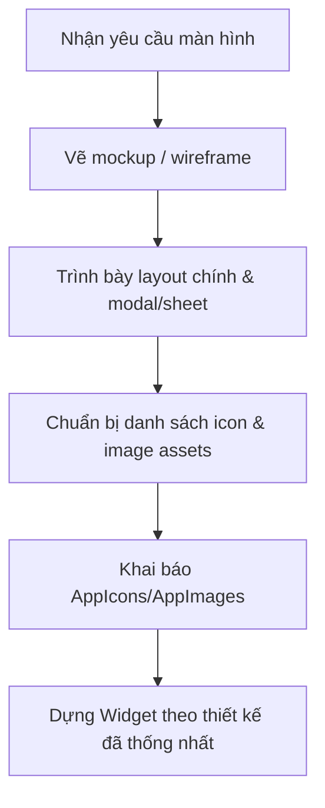

# SKILL: THIẾT KẾ UI MOCKUP & QUẢN LÝ GRAPHIC ASSETS (UI-MOCKUP-DESIGNER)

Trực quan hóa ý tưởng thiết kế thành **UI Mockup** trước khi code, thiết kế các **màn hình phụ/dialog/thông báo**, và chuẩn hóa tích hợp **icon & image assets**.

## 🎨 1. NGUYÊN TẮC VẼ UI MOCKUP

### 1.1. Khi nào cần mockup?
- Trước khi dựng màn hình lớn/phức tạp (Dashboard, danh sách, chi tiết...).
- Khi người dùng muốn xem trước thiết kế.
- Khi cần thống nhất luồng thao tác giữa màn hình chính & phụ.

### 1.2. Kỹ thuật sinh ảnh Mockup (công cụ sinh ảnh)
1. **Tỷ lệ**: `9:16` cho điện thoại, `3:4` cho tablet.
2. **Thiết kế phẳng**: **CẤM** vẽ khung viền điện thoại/notch; chỉ vẽ trực tiếp giao diện. Theo Material 3: clean, hiện đại, tương phản cao, thẻ bo góc nhẹ (12–16), tông màu theo Design Tokens.
3. **Prompt mẫu**:
   ```
   "A high-quality mobile app UI screen design for [Tên màn hình], Material 3 design system, clean modern layout, showing [các thành phần: top app bar, search/filter bar, summary metric cards, list items with avatar and status tags, bottom navigation bar]. Clean UI mockup only, no phone frame or hand, high resolution, professional mobile UX/UI."
   ```

## 📱 2. MÀN HÌNH CHÍNH & MÀN HÌNH PHỤ

### 2.1. Màn hình lớn
Phân rã thành Wireframe cấu trúc Widget trước khi code:
- **Header/AppBar**: tiêu đề, tìm kiếm, lọc, avatar/trạng thái.
- **Summary/Metric Cards**: thẻ tổng hợp số liệu.
- **Action Bar**: Thêm mới, Xuất, Quét mã...
- **Content Area**: danh sách phân trang (`ListView.builder`/`SliverList`), kéo làm mới (`RefreshIndicator`).

### 2.2. Màn hình phụ, Modal & Dialog
1. **Modal Bottom Sheet**: form nhanh, filter, action sheet — có drag handle, bo góc trên, nút submit ghim đáy.
2. **Alert/Confirmation Dialog**: xác nhận xóa/hủy — tiêu đề rõ, 2 nút (Hủy xám, Xác nhận màu chính/đỏ nếu nguy hiểm).
3. **Notification/SnackBar/Banner**: kết quả tức thời; banner cảnh báo offline (nếu dự án bật offline-first).
4. **State Placeholders**: Loading skeleton, Empty state (illustration + CTA), Error state (icon + mô tả + "Thử lại").

## 🖼️ 3. QUẢN LÝ ICON & GRAPHIC ASSETS

### 3.1. Chọn định dạng
- 🟢 **SVG** — CHỈ cho asset độ phức tạp thấp: system/action icons, tab icons, glyph đơn sắc/2 màu (dùng `flutter_svg`). SVG phức tạp (nhiều path/gradient/shadow) tốn CPU/GPU runtime → giật khung hình.
- 🟡 **WebP** — ƯU TIÊN cho asset phức tạp cao: illustrations, banner, onboarding, background. Quy trình: xuất PNG lossless rồi convert `.webp` (nén 80–90%) → giảm 30–70% dung lượng, giải mã phần cứng nhanh.

### 3.2. Cấu trúc thư mục
```
assets/
├── icons/          # SVG đơn giản
├── images/         # bitmap/banner/logo (.webp)
└── illustrations/  # ảnh minh họa phức tạp (.webp)
```

### 3.3. Khai báo asset tập trung
- **CẤM hardcode** đường dẫn chuỗi `'assets/...'` rải rác trong Widget.
- Gom vào `AppIcons`, `AppImages`, `AppIllustrations` (ví dụ `lib/core/constants/app_assets.dart`).
- Khai báo thư mục assets trong `pubspec.yaml`.

## 🚀 4. QUY TRÌNH PHỐI HỢP

