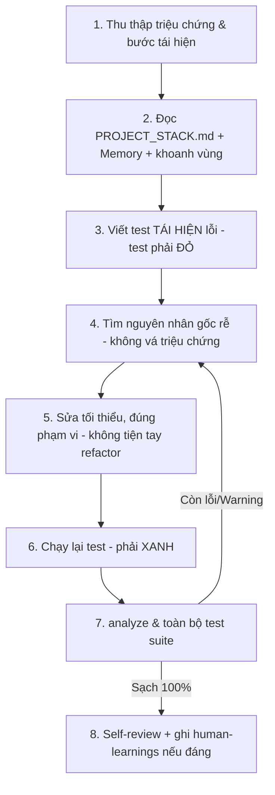

# WORKFLOW: SỬA LỖI (FIX-BUG)

Quy trình chuẩn, universal — ưu tiên **tái hiện bằng test trước khi sửa** để chống hồi quy.

## CHI TIẾT

1. **Tái hiện**: Ghi rõ input, trạng thái, kết quả sai vs kỳ vọng; xác định môi trường (OS, phiên bản).
2. **Khoanh vùng** (`rules/14`): Đọc `PROJECT_STACK.md` + `memory/context-cache.md` để hiểu module trước khi quét sâu source.
3. **Test tái hiện trước (Red)** (`rules/11`): Viết test khiến lỗi lộ ra và **fail** — đây là bằng chứng đã bắt đúng lỗi.
4. **Nguyên nhân gốc rễ**: Truy đến gốc, không che triệu chứng. Không đoán mò — đối chiếu code/API thực tế (`rules/13`).
5. **Sửa tối thiểu** (`rules/01`, `rules/12`): Đúng phạm vi; **cấm** "tiện tay refactor" code đang chạy tốt (đánh giá Blast Radius & xin duyệt nếu cần đổi lớn).
6. **Xác minh (Green)**: Test ở bước 3 chuyển xanh.
7. **Quality Gate**: `flutter analyze` (0/0) + toàn bộ `flutter test` pass — đảm bảo không gây hồi quy.
8. **Đúc kết**: Nếu lỗi đến từ hiểu nhầm/pattern sai, ghi bài học vào `memory/human-learnings.md` để không tái phạm.
