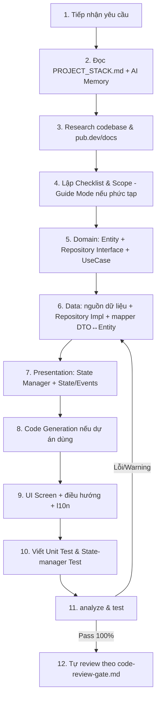

# WORKFLOW: PHÁT TRIỂN TÍNH NĂNG MỚI (NEW-FEATURE)

Quy trình chuẩn, **trung lập stack** — áp dụng công nghệ cụ thể theo `PROJECT_STACK.md` của dự án.

## CHI TIẾT

1. **Tiếp nhận yêu cầu**: Làm rõ các trường thông tin, luồng nghiệp vụ, tiêu chí hoàn thành.
2. **Đọc bối cảnh**: `PROJECT_STACK.md` (biết state mgmt/DB/network/DI/error type dự án chọn) + `memory/context-cache.md`, `memory/human-learnings.md`.
3. **Research** (`rules/13`): Đã có helper/service tương tự trong codebase chưa? Bài toán thông dụng đã có package chuẩn trên pub.dev chưa (format, mask, uuid, shimmer, connectivity...)? Đối chiếu chữ ký API thực tế, không bịa đặt.
4. **Checklist** (`rules/12`): Liệt kê file sẽ tạo/sửa trong `lib/features/[feature]/`; không đụng file ngoài scope.
5. **Domain Layer** (Pure Dart — `rules/01`):
   - `domain/entities/[name].dart` (bất biến theo model dự án chọn: freezed/equatable/manual).
   - `domain/repositories/[name]_repository.dart` (interface).
   - `domain/usecases/...` (trả về kiểu lỗi theo chuẩn dự án — Either/Result/exception).
6. **Data Layer** (`rules/03`, `rules/04`):
   - Nguồn dữ liệu cục bộ/từ xa theo DB & network lib dự án chọn.
   - Repository Impl + mapper `DTO ↔ Entity` (không lộ DTO ra domain/presentation).
   - Nếu dự án bật **Offline-First**: tuân thủ `patterns/offline-first-outbox.md`.
7. **Presentation Layer** (`rules/02`): State bất biến, không business logic trong Widget; side-effect qua listener; đăng ký qua DI dự án chọn.
8. **Code Generation** (`rules/07`): Nếu dùng, chạy generator (ví dụ `dart run build_runner build --delete-conflicting-outputs`).
9. **UI** (`rules/10`, `rules/17`, `rules/20`): Dựng màn hình đúng nguyên tắc widget, thêm chuỗi l10n, cấu hình điều hướng; đảm bảo a11y.
10. **Testing** (`rules/11`): Viết test cho UseCase + State Manager (+ Repository/Sync nếu tầng data phức tạp).
11. **Quality Gate**: `flutter analyze` (0/0) + `flutter test` (pass + coverage).
12. **Self-review**: Đối chiếu `workflows/code-review-gate.md`, cập nhật `memory/context-cache.md`.
