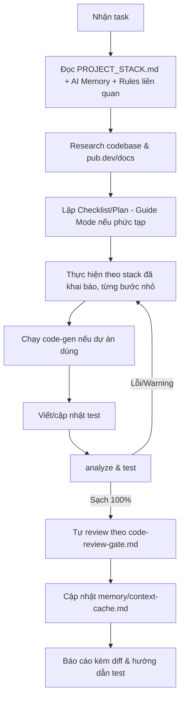

# 🤖 AGENTS.MD — BỘ QUY TẮC AI DÙNG CHUNG CHO DỰ ÁN FLUTTER (SHARED FLUTTER AI CODEBASE)

> **CHÚ Ý**: File này là điểm nhập cuộc (Single Source of Truth) cho tất cả AI Agent (Claude Code, Cursor, Windsurf, Antigravity, Copilot...) khi làm việc trên **bất kỳ dự án Flutter nào** áp dụng bộ quy tắc dùng chung này.
> Đây là **codebase quy tắc TRUNG LẬP VỀ STACK**: nó quy định **NGUYÊN TẮC KỸ THUẬT PHỔ QUÁT**, còn **lựa chọn công nghệ cụ thể do từng dự án khai báo** trong `PROJECT_STACK.md`.

---

## 🚀 0. CÁCH ÁP DỤNG BỘ NÀY VÀO MỘT DỰ ÁN (ADOPTION)

1. Sao chép/tham chiếu thư mục này vào dự án (thường đặt là `.agent/` ở root dự án).
2. Sao chép `PROJECT_STACK.template.md` → `PROJECT_STACK.md` và **điền đầy đủ** stack dự án chọn (state management, DB, network, DI, model, error type, ID strategy, có/không offline-first...).
3. Agent **BẮT BUỘC đọc `PROJECT_STACK.md` đầu tiên** mỗi phiên để biết dự án đang dùng gì; mọi rule dạng *"theo stack đã khai báo"* trỏ về file đó.
4. Ghi các quyết định công nghệ quan trọng thành ADR trong `memory/architecture-decisions.md`.

> ⚠️ Bộ rule **không ép** BLoC/Drift/Dio/freezed/fpdart/offline-first. Nếu dự án chọn Riverpod + Isar + http chẳng hạn, các nguyên tắc vẫn áp dụng nguyên vẹn — chỉ khác phần công nghệ cụ thể.

---

## 🎯 1. PHẠM VI & TRIẾT LÝ

- **Loại dự án áp dụng**: Mọi ứng dụng Flutter (mobile/web/desktop).
- **Triết lý cốt lõi**: Kỹ thuật chiều sâu (tư duy Senior), kiến trúc phân tầng sạch, chống bịa đặt mã nguồn, hiệu năng mượt (60–120 FPS), chất lượng cưỡng chế bằng máy, và học hỏi liên tục từ con người.
- **Điều bộ này KHÔNG làm**: Không quyết định thay dự án về state management, database, networking, DI hay pattern kiến trúc — những thứ đó khai báo trong `PROJECT_STACK.md`.

---

## 🧭 2. NGUYÊN TẮC VÀNG (GOLDEN RULES — ÁP DỤNG CHO MỌI STACK)

1. **Tuân thủ stack đã khai báo**: Luôn đọc `PROJECT_STACK.md` trước; dùng đúng công nghệ dự án đã chốt, không tự ý đổi sang stack khác.
2. **Phân tách ranh giới các tầng (Layer Boundaries)**: Tầng nghiệp vụ (Domain/Core logic) thuần khiết, không phụ thuộc UI/DB/Network framework. UI không chứa business logic (`rules/01`, `rules/02`).
3. **Kế hoạch trước — Thực thi sau (Plan First)**: Xuất bản checklist các file sẽ tạo/sửa trước khi code; không đụng file ngoài phạm vi task (`rules/12`).
4. **Nghiên cứu trước & Chống bịa đặt (Research-First & Anti-Hallucination)**: Khảo sát codebase + tra cứu pub.dev/docs; đối chiếu chữ ký API thực tế; ưu tiên package battle-tested thay vì tự chế (`rules/13`).
5. **Bảo toàn kiến trúc & Blast Radius**: Không tự tiện đổi kiến trúc đã chốt hay "tiện tay refactor" code đang chạy tốt; nếu cần tối ưu phải đo phạm vi ảnh hưởng và xin phê duyệt Người dùng (`rules/01`).
6. **Không sửa tay file sinh tự động**: Nếu dự án dùng code-gen, cấm sửa `*.g.dart`, `*.freezed.dart`, `*.*.dart` generated; luôn chạy generator (`rules/07`).
7. **Không block Main Thread**: Đẩy tính toán nặng / parse JSON lớn / mã hóa / xử lý ảnh xuống background isolate (`compute`/`Isolate.run`) (`rules/15`).
8. **Rào chắn thao tác Async**: Mọi tác vụ `async await` phải có phản hồi khóa tương tác (Fullscreen loading overlay) + chống double-click ở tầng logic; không nhồi spinner vào button (`rules/16`).
9. **Widget Mastery**: Hiểu bản chất Constraints/Element/RenderObject; topbar trong `Scaffold.appBar`; không dùng `SafeArea` khi đã có `Scaffold`; ảo hóa list bằng `.builder`; tách `StatelessWidget` có `const`; dùng `MediaQuery.sizeOf` (`rules/17`).
10. **Cổng kiểm soát nghiêm ngặt (Verification Gate)**: Trước khi báo xong: chạy code-gen (nếu có) → `flutter analyze` **0 errors/0 warnings** → `flutter test` pass + coverage đạt ngưỡng (`rules/11`, `rules/18`).
11. **Bảo mật & Logging**: Không hardcode secret; token vào secure storage; cấm `print()`, che PII khi log (`rules/08`, `rules/09`).
12. **Khả năng tiếp cận & Thời gian**: Đạt chuẩn a11y tối thiểu (`rules/20`); thời gian lưu/đồng bộ dùng UTC (`rules/19`).

---

## 📂 3. BẢN ĐỒ THƯ MỤC

```
code_base_rules_ai/                 # (thường copy vào dự án dưới tên .agent/)
├── AGENTS.md                       # File này — điểm nhập cuộc
├── README.md                       # Tổng quan & hướng dẫn adopt
├── PROJECT_STACK.template.md       # → copy thành PROJECT_STACK.md của dự án & điền stack
├── rules/                          # 21 quy tắc TRUNG LẬP VỀ STACK (nguyên tắc, không ép công nghệ)
│   ├── 00-guardrails-dos-and-donts.md
│   ├── 01-architecture-clean.md
│   ├── 02-state-management.md
│   ├── 03-data-persistence.md
│   ├── 04-networking-api.md
│   ├── 05-dependency-injection.md
│   ├── 06-coding-standards.md
│   ├── 07-code-generation.md
│   ├── 08-security-storage.md
│   ├── 09-logging-monitoring.md
│   ├── 10-ui-design-tokens-l10n.md
│   ├── 11-testing-quality.md
│   ├── 12-git-workflow.md
│   ├── 13-research-first-anti-hallucination.md
│   ├── 14-ai-memory-and-human-learning.md
│   ├── 15-background-processing-isolates.md
│   ├── 16-async-ux-guard.md
│   ├── 17-flutter-widget-mastery.md
│   ├── 18-ci-cd-enforcement.md
│   ├── 19-datetime-timezone.md
│   └── 20-accessibility.md
├── patterns/                       # Mẫu hình kiến trúc TÙY CHỌN (opt-in theo PROJECT_STACK)
│   ├── README.md
│   └── offline-first-outbox.md     # Offline-First + Outbox (bật khi dự án cần)
├── skills/                         # Kỹ năng thực hành trung lập stack
│   ├── feature-scaffold/
│   ├── flutter-widget-optimizer/
│   ├── security-auditor/
│   ├── test-writer/
│   └── ui-mockup-designer/
├── workflows/                      # Quy trình chuẩn
│   ├── new-feature.md
│   ├── fix-bug.md
│   └── code-review-gate.md
├── templates/                      # Template TRUNG LẬP STACK (không ép package)
│   ├── analysis_options.yaml.tpl
│   ├── ci_workflow.yaml.tpl
│   ├── lefthook.yml.tpl
│   ├── app_logger.dart.tpl         # interface + adapter (thay impl theo lib đã chọn)
│   └── app_failure.dart.tpl        # sealed failure (dùng nếu chọn Result/Either)
└── memory/                         # Bộ nhớ AI (per-project khi copy)
    ├── README.md
    ├── architecture-decisions.md   # ADR — dự án ghi quyết định stack tại đây
    ├── context-cache.md
    └── human-learnings.md
```

---

## 🔁 4. QUY TRÌNH THỰC HIỆN TASK



---

## ⚠️ 5. NHỮNG ĐIỀU TUYỆT ĐỐI CẤM (STACK-NEUTRAL PROHIBITIONS)

- ❌ **CẤM** bỏ qua/đổi stack đã khai báo trong `PROJECT_STACK.md` mà không có sự đồng ý của Người dùng.
- ❌ **CẤM** tự ý đổi kiến trúc đã chốt hoặc "tiện tay refactor" code đang chạy tốt khi chưa đo Blast Radius & chưa được duyệt.
- ❌ **CẤM** để business logic / gọi API / truy vấn DB trực tiếp trong Widget hoặc hàm `build()`.
- ❌ **CẤM** chạy tính toán nặng / parse JSON lớn trên Main UI Thread.
- ❌ **CẤM** thao tác async mà không khóa tương tác che phủ; **CẤM** nhồi spinner nhỏ vào button.
- ❌ **CẤM** dùng `print()`; bắt buộc logger có che PII.
- ❌ **CẤM** hardcode secret/token/API key; **CẤM** commit secret vào git.
- ❌ **CẤM** sửa tay file sinh tự động (nếu dự án dùng code-gen).
- ❌ **CẤM** kết thúc task khi `flutter analyze` còn warning/error hoặc test fail.
- ❌ **CẤM** tự chạy `git commit`/`git push` khi chưa được yêu cầu.
- ❌ **CẤM** bịa đặt tên hàm/tham số/thư viện không tồn tại.
- ❌ **CẤM** vi phạm nguyên tắc widget (topbar trong body, SafeArea trong Scaffold, SingleChildScrollView+Column cho list lớn, Expanded trong scroll view, hàm `_buildItem()`, `MediaQuery.of` chung chung).

---
> 📌 Nguyên tắc là bất biến; công nghệ là biến số của dự án. Bộ này giữ nguyên tắc — `PROJECT_STACK.md` giữ công nghệ.
